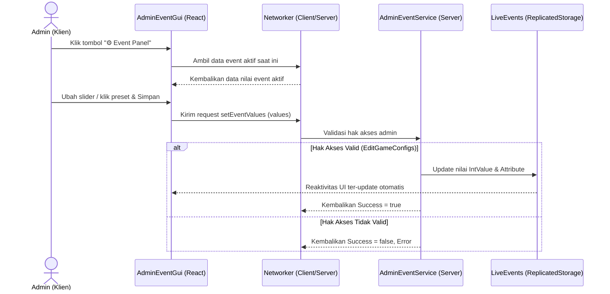

# Desain Spesifikasi: Admin Event Management GUI Panel

**Tanggal**: 2026-06-15  
**Topik**: Admin Event Management GUI  
**Status**: Disetujui  

---

## 1. Ringkasan Fitur
Mengubah sistem manajemen event game F1-Tycoon yang sebelumnya berbasis perintah chat teks (Chat Commands) menjadi sistem panel antarmuka grafis (GUI) yang interaktif, reaktif, dan eksklusif bagi staf admin. Fitur tambahan mencakup peningkatan peluang varian spesifik (boost per variant) untuk varian-varian langka.

---

## 2. Arsitektur & Sinkronisasi Client-Server

Sistem panel ini memisahkan tampilan UI di klien dengan penegakan aturan di server untuk keamanan penuh.



### Validasi Keamanan (Anti-Cheat)
* **Klien**: Tombol pembuka panel `"AdminEventBtn"` hanya akan disuntikkan secara dinamis di bagian bawah menu `SideMenuGui.MainContainer` milik pemain jika pemain memiliki izin `EditGameConfigs` (membaca dari `player:GetAttribute("Role")` lalu mencocokkannya ke `RoleConfig.Roles`).
* **Server**: Server memvalidasi ulang setiap remote call/RPC menggunakan `RoleManager.hasPermission(player, "EditGameConfigs")`. Request dari klien ilegal akan otomatis ditolak.

### Reaktivitas Sinkronisasi
* Nilai parameter event disimpan di `ReplicatedStorage.LiveEvents` sebagai `IntValue` dan `Attribute`.
* Ketika server memperbarui nilai-nilai ini, Roblox akan mereplikasi perubahan secara otomatis ke seluruh klien game.
* GUI Panel Admin membaca nilai tersebut secara langsung dari `ReplicatedStorage` sehingga status panel (Status Display) akan ter-update secara otomatis di layar admin, baik saat ia menyetel event maupun saat admin lain menyetelnya.

---

## 3. Desain Visual & Tata Letak GUI

GUI Panel ini didesain dengan konsep **Modern Dark Theme (Glassmorphism)** menggunakan React di Roblox Studio dengan pembagian kolom responsif:

### A. Panel Kiri: Kontrol Parameter (Sliders & Inputs)
Berisi input slider untuk mengatur nilai boost event. Di samping setiap slider terdapat indikator angka persentase aktif dan kotak input angka manual (TextBox) untuk pengetikan presisi.
* **Luck Boost**: Slider `0` - `500%`.
* **EXP Boost**: Slider `0` - `500%`.
* **Speed Boost**: Slider `0` - `100%`.
* **Global Variant Boost**: Slider `0` - `100%`.
* **Varian Khusus (Accordion / Collapsible Sub-Section)**:
  * Golden Boost (`0` - `50%`)
  * Rainbow Boost (`0` - `50%`)
  * Galaxy Boost (`0` - `50%`)
  * Hellfire Boost (`0` - `50%`)
* **Tombol Aksi**:
  * **STOP ALL EVENTS**: Tombol besar berwarna merah menyala (`Color3.fromRGB(190, 45, 45)`) untuk mematikan semua event seketika.
  * **APPLY CHANGES**: Tombol untuk mengirimkan perubahan nilai slider ke server.

### B. Panel Kanan: Status Monitor & Preset Instan
* **Status Monitor (Live Info)**: Menampilkan nilai event yang *sedang aktif saat ini di server* secara reaktif.
* **Tombol Preset Instan**:
  * **Double EXP**: Mengatur EXP = 100%, lainnya = 0.
  * **Lucky Hype**: Mengatur Luck = 200%, Global Variant = 10%, lainnya = 0.
  * **Weekend Boost**: Mengatur EXP = 150%, Luck = 150%, Global Variant = 20%, Speed = 10%.

---

## 4. Logika Server & Kalkulasi Gacha

### Parameter Baru di Server (`EventManager.server.luau`)
Parameter baru akan dibuat di dalam folder `ReplicatedStorage.LiveEvents` saat server dimulai:
* `VariantBoost_Golden` (`IntValue` - default `0`)
* `VariantBoost_Rainbow` (`IntValue` - default `0`)
* `VariantBoost_Galaxy` (`IntValue` - default `0`)
* `VariantBoost_Hellfire` (`IntValue` - default `0`)

### Endpoints Networker (`AdminEventService`)
* `setEventValues(player, valuesTable)`:
  * Validasi izin staf admin.
  * Lakukan *clamping* ketat pada server:
    * `LuckBoost` -> `math.clamp(val, 0, 500)`
    * `ExpBoost` -> `math.clamp(val, 0, 500)`
    * `SpeedBoost` -> `math.clamp(val, 0, 100)`
    * `VariantBoost` -> `math.clamp(val, 0, 100)`
    * `VariantBoost_Golden/Rainbow/Galaxy/Hellfire` -> `math.clamp(val, 0, 50)`
  * Terapkan nilai ke `IntValue` dan `Attribute` terkait di `ReplicatedStorage`.
* `stopAllEvents(player)`:
  * Mereset seluruh nilai event di atas kembali ke `0`.
* **Fallback Chat Commands**: Sistem chat commands lama (seperti `/luck`, `/exp`, `/stop`) tetap dipertahankan sebagai cadangan (backwards compatibility).

### Kalkulasi Peluang Gacha (`SpawnerBoxManager.luau`)
Modifikasi kalkulasi peluang varian (`totalChance`) untuk memasukkan spesifik variant boost:
```lua
-- Cari boost spesifik untuk varian ini dari LiveEvents
local specVariantBoost = 0
local specVariantNode = liveEvents:FindFirstChild("VariantBoost_" .. vName)
if specVariantNode then
    specVariantBoost = specVariantNode.Value
end

-- Masukkan ke kalkulasi total peluang
local totalChance = vData.Chance + specUpgrade + allUpgrade + globalVariantBoost + specVariantBoost
```

---

## 5. Rencana Pengujian
1. **Pengujian Izin**: Pastikan pemain dengan role Non-Admin (seperti "Player" atau "VIP") tidak melihat tombol panel dan ditolak oleh server jika mencoba menembak Remote call.
2. **Pengujian Preset**: Pastikan tombol preset instan seperti "Weekend Boost" menyetel seluruh parameter dengan tepat.
3. **Pengujian Reset (Stop All)**: Pastikan tombol STOP ALL mengembalikan seluruh nilai parameter ke `0` dan memperbarui status tampilan di layar.
4. **Pengujian Kalkulasi Peluang**: Lakukan verifikasi kalkulasi peluang gacha box saat `GoldenBoost` aktif untuk memastikan rate kemunculan Golden Car meningkat sesuai parameter event.
