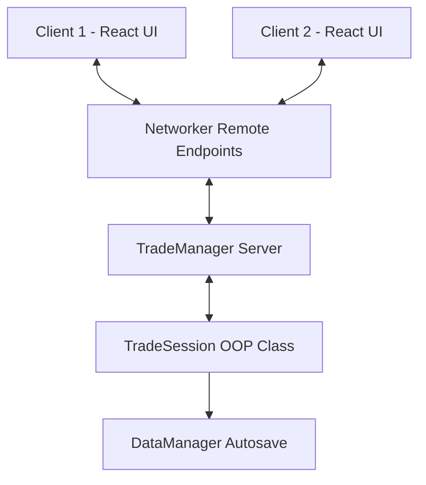

# Desain Spesifikasi: Fitur Trading Car (F1-Tycoon)

Dokumen ini mendefinisikan rancangan teknis, arsitektur, keamanan, dan komponen UI/UX untuk fitur **Trading Car** pada proyek **F1-Tycoon**.

---

## 1. Pendahuluan
Fitur **Trading Car** memungkinkan pemain untuk bertukar mobil secara aman di dalam server yang sama. Fitur ini dirancang terpusat pada server (*Server-Centric*) menggunakan konsep Object-Oriented Programming (OOP) untuk state management, guna menghindari eksploitasi duplikasi barang dan manipulasi transaksi oleh client.

---

## 2. Kebutuhan & Batasan Sistem
*   **Item yang Diizinkan**: Hanya mobil (`Car`) yang ada di dalam `Backpack` pemain yang dapat ditukarkan. Uang (`Cash`) dan Kotak (`Box`) tidak dapat ditukarkan.
*   **Batas Minimal**: Pemain wajib memiliki minimal **5 Rebirth** di leaderstats mereka untuk dapat mengirim maupun menerima permintaan trade.
*   **Metode Inisiasi**:
    1.  **Klik Fisik**: Menggunakan `ProximityPrompt` atau klik mouse langsung pada karakter pemain lain.
    2.  **Daftar Pemain**: Melalui menu UI samping (Side Menu) dengan menekan tombol "Trade" di samping nama pemain yang aktif.
*   **Keamanan Anti-Scam**: Menggunakan sistem konfirmasi 2 langkah:
    1.  **Lock (Kunci)**: Mengunci daftar penawaran agar tidak bisa diubah lagi. Jika lawan trade mengubah tawarannya, status lock milik kita otomatis terbuka kembali.
    2.  **Confirm (Konfirmasi)**: Hanya aktif jika kedua belah pihak sudah me-lock tawaran mereka, disertai hitung mundur 3 detik sebelum eksekusi transfer data.

---

## 3. Arsitektur Sistem & Data Flow

Sistem ini terbagi menjadi beberapa komponen utama:



### A. Server Components
1.  **`TradeManager`**:
    *   Mendengarkan permintaan inisiasi trade dari pemain.
    *   Mengecek validasi awal (jarak antar pemain jika klik fisik, status ketersediaan pemain, batasan minimal 5 Rebirth).
    *   Mengatur cooldown request trade agar tidak terjadi spamming undangan.
    *   Membuat instansi `TradeSession` baru setelah undangan diterima.
2.  **`TradeSession` (OOP Module)**:
    *   Kelas OOP yang merepresentasikan sesi trade aktif antara dua pemain (`Player1` dan `Player2`).
    *   Menyimpan state lokal sesi di memori server.
    *   Mengekspos metode:
        *   `AddCar(player, carUUID)`
        *   `RemoveCar(player, carUUID)`
        *   `Lock(player)`
        *   `Confirm(player)`
        *   `Cancel(player)`
    *   Memancarkan perubahan state secara real-time ke kedua client menggunakan event `TradeStateUpdate`.

---

## 4. Struktur Data Sesi (TradeSession State)

Server akan mereplikasi tabel state berikut ke kedua client setiap kali terjadi perubahan:

```luau
type TradeSessionState = {
    SessionId: string,
    Player1: Player,
    Player2: Player,
    Offer1: { string }, -- List UUID/Nama unik mobil yang ditawarkan Player 1
    Offer2: { string }, -- List UUID/Nama unik mobil yang ditawarkan Player 2
    IsLocked1: boolean,
    IsLocked2: boolean,
    IsConfirmed1: boolean,
    IsConfirmed2: boolean,
    CountdownActive: boolean,
    CountdownSeconds: number,
}
```

---

## 5. Protokol Keamanan & Alur Validasi

Untuk mencegah eksploitasi duplikasi item, server harus menerapkan aturan validasi ketat pada setiap state:

### A. Validasi Inisiasi
1.  Server memvalidasi apakah target pemain ada di dalam server yang sama.
2.  Server memverifikasi `player.leaderstats.Rebirths.Value >= 5` untuk kedua pemain.

### B. Validasi Pengubahan Item (Add/Remove)
1.  Ketika pemain meminta menambah mobil via remote event, server harus memindai `player.Backpack` dan memastikan objek mobil tersebut benar-benar ada dan tidak sedang ditawarkan dalam trade lain.
2.  Server harus memverifikasi bahwa `IsLocked` pemain tersebut bernilai `false`. Jika sudah dikunci, permintaan edit item ditolak.
3.  Jika ada item yang ditambahkan atau dihapus oleh Player A, status `IsLocked` milik Player B secara otomatis di-reset oleh server menjadi `false`.

### C. Alur Penguncian & Hitung Mundur (Lock & Confirm)
1.  Ketika kedua pemain mengaktifkan `IsLocked = true`, server mengaktifkan `CountdownActive = true` dan memulai hitung mundur 3 detik.
2.  Selama hitung mundur berjalan, jika salah satu pemain melakukan `Cancel` atau membuka kunci penawaran, hitung mundur dibatalkan seketika dan state direplikasi ulang.
3.  Pemain hanya dapat mengklik tombol **Confirm** ketika hitung mundur sedang berjalan atau telah selesai.

### D. Eksekusi Akhir (Atomic Transaction)
Begitu kedua pemain menekan **Confirm** dan hitung mundur selesai:
1.  Server membekukan (freeze) input untuk sesi trade tersebut.
2.  Server memindai kembali `Backpack` Player 1 dan Player 2 secara menyeluruh untuk memastikan **semua** mobil dalam daftar penawaran masih ada di tangan pemiliknya yang sah.
3.  Jika ada satu saja mobil yang hilang (karena dijual/dihapus via exploit), trade **dibatalkan secara instan** dengan status error.
4.  Jika validasi lolos:
    *   Server memindahkan kepemilikan mobil secara fisik (mengubah `Parent` mobil ke Backpack pemain lawan, mengubah atribut `Owner`, dan menyinkronkan nama objek).
    *   Server langsung memanggil `DataManager.syncData()` untuk kedua pemain agar data terbaru langsung tersimpan di DataStore dan mencegah eksploitasi rollback.

---

## 6. Desain Komponen UI/UX (React Client)

### A. `TradeRequestPopup`
*   Notifikasi melayang di layar bagian atas/tengah.
*   Teks: `[Nama Pemain] mengajak Anda untuk melakukan Trade Mobil (Min. Rebirth 5)`.
*   Tombol: `Terima` (Hijau) dan `Tolak` (Merah).
*   Auto-timeout: 15 detik akan menutup pop-up dan mengirimkan status penolakan ke server.

### B. `TradePanel`
*   Modal besar di tengah layar dengan latar belakang gelap semi-transparan (*glassmorphism*).
*   **Header**: Judul `TRADING SYSTEM`, informasi nama lawan trade.
*   **Main Body (Dua Sisi)**:
    *   **Sisi Kiri**: Grid daftar mobil yang kita tawarkan. Di bawahnya terdapat tombol besar `LOCK OFFER` (jika belum dikunci) or `UNLOCK` (jika sudah dikunci).
    *   **Sisi Kanan**: Grid daftar mobil yang ditawarkan lawan trade. Di bawahnya terdapat status text `READY` / `DRAFTING`.
*   **Footer Controls**:
    *   Tombol `BATAL (Cancel)` di sudut kiri bawah untuk menutup panel kapan saja.
    *   Tombol `CONFIRM TRADE` di bagian tengah bawah. Tombol ini abu-abu (tidak aktif) dan berubah menjadi hijau terang dengan teks hitung mundur `CONFIRM (3s)` ketika kedua belah pihak telah mengunci tawaran mereka.
*   **Inventori Mobil (Sisi Bawah/Slide Overlay)**:
    *   Menampilkan daftar kartu mobil yang kita miliki di tas.
    *   Dilengkapi dengan kolom pencarian aman (menggunakan parameter pencarian plain string `string.find(..., ..., 1, true)` untuk mencegah crash regex malformed pattern).

---

## 7. Rencana Pengujian (Test Plan)
1.  **Uji Batasan Rebirth**: Memastikan pemain dengan Rebirth < 5 tidak dapat mengklik tombol trade maupun menerima tawaran trade.
2.  **Uji Fungsionalitas Penguncian**: Memverifikasi bahwa jika Player A menambah item setelah Player B melakukan lock, status lock Player B otomatis terbuka kembali di server dan client.
3.  **Uji Keamanan Double-Spending**: Mencoba menjual mobil di Sell Area fisik sesaat setelah menekan tombol Lock/Confirm untuk memastikan server mendeteksi hilangnya item tersebut dan membatalkan trade.
4.  **Uji Network Lag**: Mensimulasikan latensi tinggi (ping > 500ms) untuk memastikan state server tetap konsisten dan tidak terjadi duplikasi barang.
