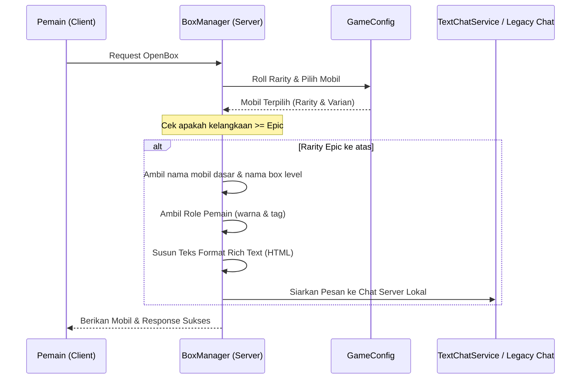

# Desain Sistem Pengumuman Chat (Gacha Mobil & Pembelian Gamepass Global)

## 1. Ringkasan (Overview)
Sistem ini dirancang untuk meningkatkan interaksi sosial dan prestise di dalam game dengan mengirimkan pesan pengumuman otomatis ke jendela obrolan (chat) pemain. Sistem ini mencakup dua fitur utama:
1. **Pengumuman Gacha Mobil (Server-Local):** Mengumumkan di server lokal ketika seorang pemain berhasil mendapatkan mobil dengan tingkat kelangkaan *Epic* ke atas dari pembukaan kotak gacha.
2. **Pengumuman Gamepass (Global):** Mengumumkan ke seluruh server aktif (global) ketika seorang pemain membeli Gamepass apapun, sekaligus memproses pembaruan role VIP secara instan tanpa perlu memuat ulang game.

---

## 2. Arsitektur & Alur Data (Architecture & Data Flow)

### A. Pengumuman Gacha Mobil (Lokal)
Alur proses terjadi sepenuhnya di dalam file server [BoxManager.luau](file:///C:/Project/Roblox Studio Projects/Projects/F1-Tycoon/src/ServerScriptService/BoxManager/BoxManager.luau) saat fungsi `openBox` dijalankan:



### B. Pengumuman Gamepass (Global)
Alur proses pembelian gamepass menggunakan `MessagingService` untuk siaran lintas server, yang dikelola di dalam [RoleManager.luau](file:///C:/Project/Roblox Studio Projects/Projects/F1-Tycoon/src/ServerScriptService/RoleManager/RoleManager.luau):

```mermaid
sequenceDiagram
    participant Player as Pemain (Client)
    participant MS as MarketplaceService (Roblox)
    participant RoleMgr as RoleManager (Server Asal)
    participant MsgService as MessagingService (Global)
    participant OtherServers as Server Aktif Lainnya
    participant Chat as TextChatService (Semua Server)

    Player->>MS: Membeli Gamepass
    MS-->>RoleMgr: PromptGamePassPurchaseFinished (WasPurchased = true)
    
    rect rgb(30, 40, 50)
        Note over RoleMgr: Cek jika Gamepass = VIP_GAMEPASS_ID
        RoleMgr->>RoleMgr: Update role pemain menjadi "VIP" di cache & atribut instan
    end
    
    RoleMgr->>MS: Ambil Detail Gamepass (GetProductInfoAsync)
    MS-->>RoleMgr: Data Gamepass (Nama Gamepass)
    RoleMgr->>MsgService: Publish data ke topik "GlobalGamePassPurchase"
    MsgService-->>OtherServers: Distribusikan Payload Pembelian
    
    par Server Asal & Server Lainnya
        OtherServers->>Chat: Tampilkan "🌐 [Role] Pemain baru saja membeli Gamepass!"
    end
```



---

## 3. Spesifikasi Teknis (Technical Specifications)

### A. Konfigurasi Rarity & Ambang Batas (Threshold)
Pesan gacha hanya dikirim untuk tingkat kelangkaan berikut (sesuai konfigurasi [GameConfig.luau](file:///C:/Project/Roblox Studio Projects/Projects/F1-Tycoon/src/ReplicatedStorage/GameConfig.luau)):
* `Epic` (#B432FF)
* `Legendary` (#FFA500)
* `Mythic` (#FF3232)
* `God` (#FFFF00)
* `Celestial` (#FFFFFF)
* `Admin` (#FF0000)

### B. Struktur Payload Global (MessagingService)
Topik publikasi: `"GlobalGamePassPurchase"`
Payload JSON:
```json
{
  "PlayerName": "NamaPlayer",
  "GamePassName": "NamaGamepass",
  "RoleName": "VIP"
}
```

### C. Pemformatan Teks Rich Text (TextChatService)
Pesan diformat menggunakan tag HTML yang didukung oleh Roblox `TextChatService`:
* **Gacha Mobil:**
  `<font color='#[RoleColor]'><b>[[Emoji] [RoleName]] [PlayerName]</b></font><font color='#[RarityColor]'>: telah mendapatkan mobil <b>[CarName]</b> dari <b>[BoxName]</b></font>`
* **Gamepass Global:**
  `🌐 <font color='#[RoleColor]'><b>[[Emoji] [RoleName]] [PlayerName]</b></font><font color='#ffc800'>: baru saja membeli Gamepass <b>[GamepassName]</b>!</font>`

*(Catatan: Jika pemain tidak memiliki role khusus / "Player", awalan `[RoleName]` dilewati dan langsung menampilkan nama pemain).*

### D. Penanganan Fallback Legacy Chat
Jika game berjalan di server dengan sistem chat lama (`LegacyChatService`), tag HTML akan disaring menggunakan ekspresi reguler `string.gsub(text, "<[^>]+>", "")` agar tidak menampilkan kode mentah, dan pesan polos tersebut dikirim dengan warna default rarity/gamepass:
```lua
channel:SendSystemMessage(plainText, "System", { ChatColor = targetColor })
```

---

## 4. Rencana Pengujian (Testing Plan)
1. **Verifikasi Gacha Mobil:**
   * Membuka kotak gacha dengan mobil rarity *Common* -> pastikan tidak ada pengumuman chat.
   * Membuka kotak gacha dengan mobil rarity *Epic/Legendary* -> pastikan pesan chat terkirim secara lokal di server dengan warna dan penebalan (bold) yang sesuai.
2. **Verifikasi Beli Gamepass & Peran VIP:**
   * Simulasikan pembelian VIP Gamepass -> pastikan role pemain di server langsung berubah menjadi VIP, dan pengumuman global dengan ikon `🌐` dikirimkan ke chat.
3. **Verifikasi Keamanan Layanan:**
   * Membungkus fungsi `MessagingService` dan `MarketplaceService` dalam blok `pcall` untuk mencegah kegagalan kritis jika API Roblox mengalami downtime.
